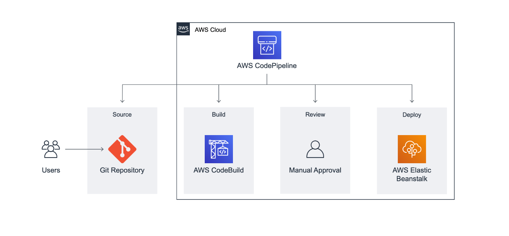

# Application Architecture
 A continuous delivery pipeline that will automatically deploy the web application whenever the source code is updated.
 This application uses GitHub, AWS Elastic Beanstalk, AWS CodeBuild, and AWS CodePipeline.
 
 

### High Level Implementation

1. Set up a GitHub repository to store the application code.
2. Create the environment where the web application will be deployed using AWS Elastic Beanstalk.
3. Configure and start the build process for the application using AWS CodeBuild.
4. Create a pipeline to automatically build and deploy the application using AWS CodePipeline.
5. Add a review stage to the pipeline and test the pipeline.
 
## AWS Elastic Beanstalk Node.js Sample App

This repository contains a sample Node.js web application built using [Express](https://expressjs.com/).

## Security

See [CONTRIBUTING](CONTRIBUTING.md#security-issue-notifications) for more information.

## License

This library is licensed under the MIT-0 License. See the LICENSE file.

